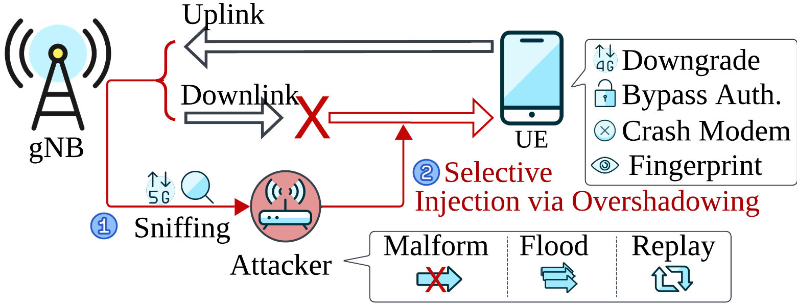
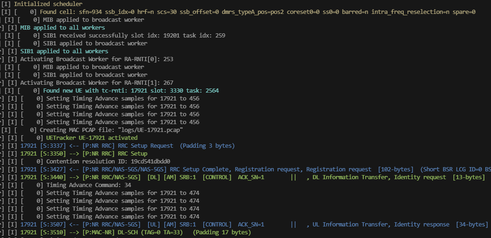
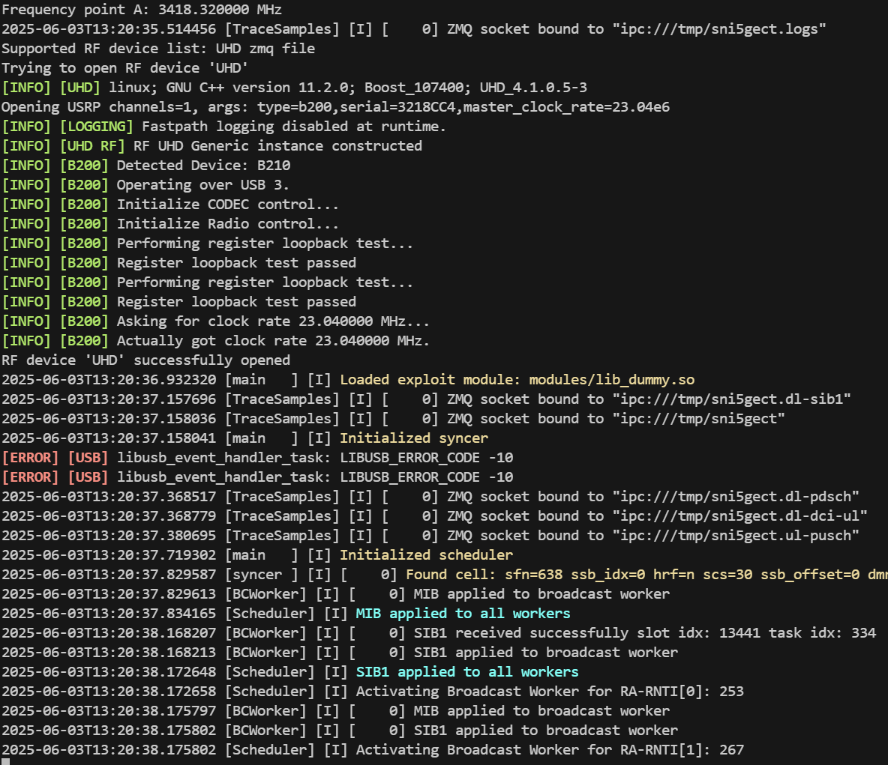
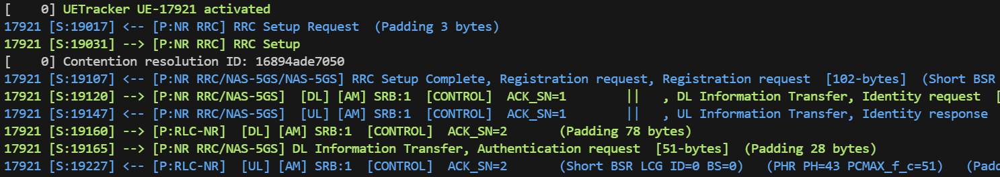
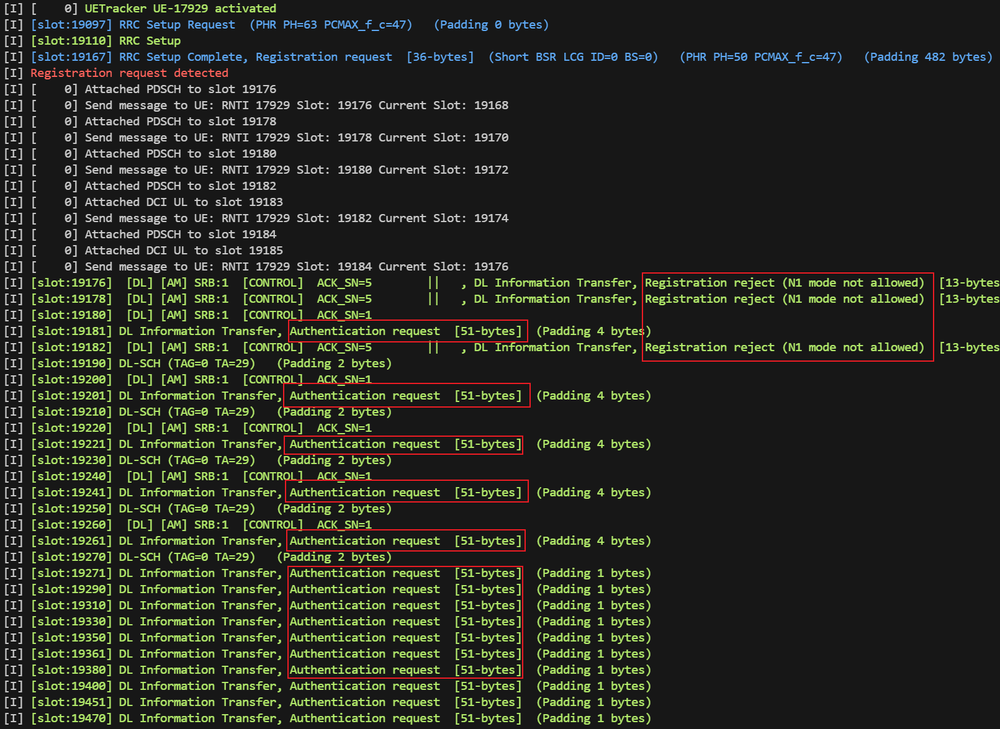
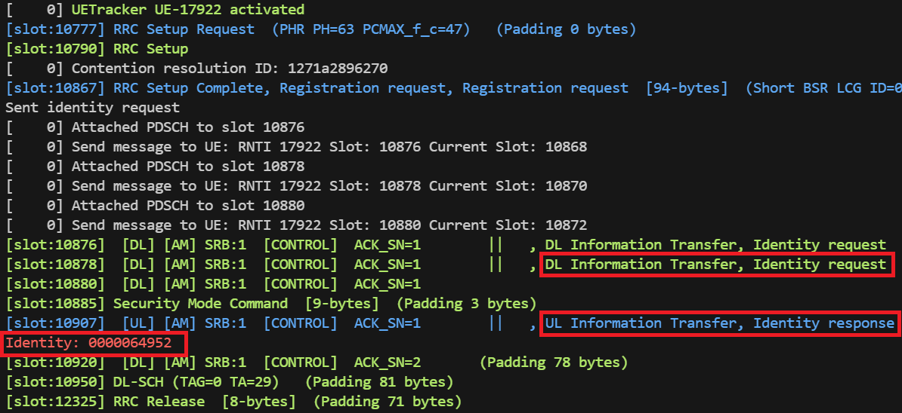
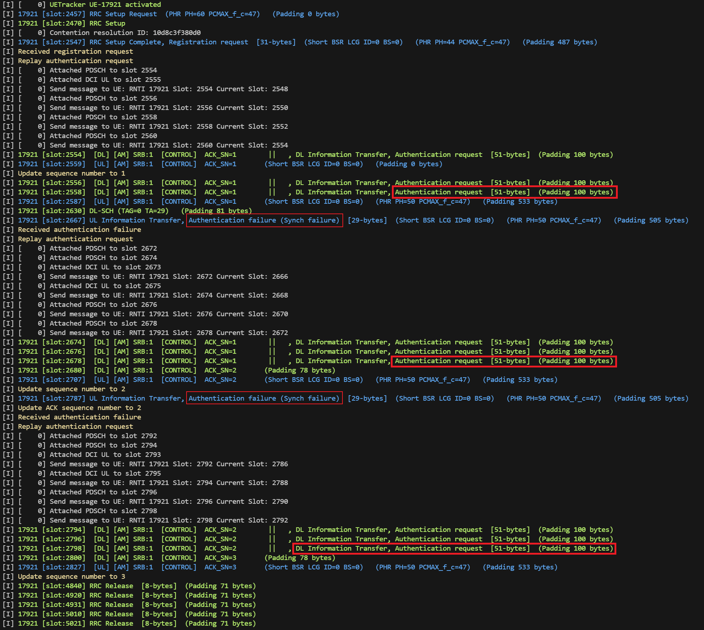
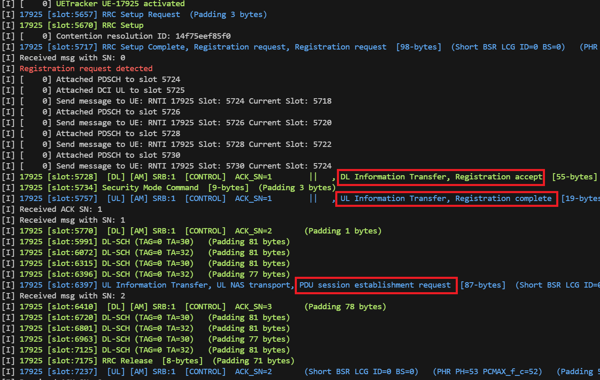
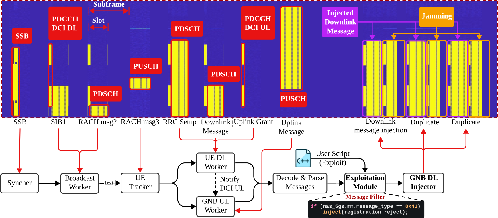

<a href="http://sni5gect.com/">
  
</a>

# 5G NR 嗅探与利用

<p align="left">
<a href="http://sni5gect.com/">
    
    
    
</a>
</p>

**Sni5Gect** 是一个用于嗅探未加密 5G 消息，并向基站与 User Equipment (UE) 之间空口通信注入自定义数据包的框架。它可用于安全研究，执行诸如使 UE modem 崩溃、网络降级、设备指纹识别以及认证绕过等攻击。该工具已经在商用 UE（智能手机、modem）以及 srsRAN/Effnet 基站上完成测试。

#### 核心特性
* 🔎 Sniff：捕获基站与 UE 之间未加密的 5G MAC-NR 消息。
* 💉 Inject：在特定通信状态下，向目标 UE/基站发送任意 MAC-NR 消息。
#### 典型使用场景
* 💥 使 UE modem 崩溃。
* 📉 降级攻击（5G 到 4G）。
* 👆 设备指纹识别。
* 👹 异常检测。

*Sni5Gect 的 artifacts 论文在第 34 届 USENIX Security Symposium 中获得了 **Available**、**Functional** 和 **Reproduced** 徽章。Artifacts PDF 可在[这里](https://raw.githubusercontent.com/asset-group/Sni5Gect-5GNR-sniffing-and-exploitation/main/docs/_media/USENIX_Security__25_Artifact_Appendix__SNI5GECT__A_Practical_Approach_to_Inject_aNRchy_into_5G_NR.pdf)获取。*

<a id="overview"></a>
## 概览



## 通过 Docker 快速开始

我们建议在 Ubuntu 22.04 Docker 容器中运行完整栈，以确保依赖一致，并避免影响本地环境。

构建并启动 Docker 容器：

```bash
docker compose build sni5gect # 构建容器
docker compose up -d sni5gect # 启动容器
docker exec -it sni5gect bash # 进入容器
./build/shadower/shadower configs/srsran-n78-20MHz-b210.yaml # 在 N78、20MHz 带宽下运行 Sniffer
# 参见 README.md 中的 Running Sni5Gect 章节
```

---

## 目录

- [功能支持](#features-supported)
- [环境要求](#requirements)
- [运行 Sni5Gect](#running-sni5gect)
- [Exploit 模块](#exploit-modules)
  - [Sniffing：DL/UL 与 DCI](#sniffing-dlul--dci)
  - [Crash：5Ghoul Attacks](#crash-5ghoul-attacks)
  - [Downgrade：Registration Reject](#downgrade-registration-reject)
  - [Fingerprinting：Identity Request](#fingerprinting-identity-request)
  - [Downgrade：Authentication Replay](#downgrade-authentication-replay)
  - [Authentication Bypass：Registration Accept 5G AKA bypass](#authentication-bypass-registration-accept-5g-aka-bypass)
- [示例配置](#example-configuration)
- [组件概览](#overview-of-components)
- [项目结构](#project-structure)
- [免责声明](#disclaimer)
- [引用 Sni5Gect](#citing-sni5gect)

<a id="features-supported"></a>
## 功能支持

我们已在以下配置下完成测试：

- 频段：n78、n41 (TDD)、n3 (FDD)
- 频率：3427.5 MHz、2550.15 MHz、1865.0 MHz
- 子载波间隔：30 kHz、15 KHz
- 带宽：20–50 MHz
- MIMO 配置：Single-input single-output (SISO)
- 距离：0 米到最高 20 米（使用放大器）

一个 srsRAN 基站配置示例位于 `configs/base_station/srsran-n78-20MHz.yml`。

<a id="requirements"></a>
## 环境要求

### 硬件要求

Sni5Gect 使用 USRP Software Defined Radio (SDR) 设备，在合法 5G 基站与 UE 通信期间发送和接收 IQ 样本。当前支持以下 SDR：

- USRP B210 SDR
- USRP x310 SDR

宿主机建议配置：

- 最低：12 核 CPU
- 16 GB RAM

我们的测试环境使用 AMD 5950x 处理器和 32 GB 内存。

### 软件要求

- 操作系统：Ubuntu 22.04（容器化环境）
- 注意：宿主机应专用于运行 Sni5Gect，不应同时运行高资源占用应用（如 GUI），以防止 SDR overflow。

#### Sni5Gect 依赖以下软件组件

- [wDissector](https://github.com/asset-group/5ghoul-5g-nr-attacks)，用于分析空口流量。
- [Wireshark display filters](https://www.wireshark.org/docs/dfref/)，用于识别通信状态。

Sni5Gect 构建于 [srsRAN 4G](https://github.com/srsran/srsRAN_4G) 之上，并使用了其中的 SSB search、PBCH decoding、PDCCH decoding、PDSCH encoding/decoding 以及 PUSCH decoding 等特性。

### 已评估设备

以下 COTS 设备已完成评估：

|Model|Modem|Patch Version|
|-----|-----|-------------|
|OnePlus Nord CE 2 IV2201|MediaTek MT6877V/ZA|2023-05-05|
|Samsung Galaxy S22 SM-S901E/DS|Snapdragon X65|2024-06-01|
|Google Pixel 7 |Exynos 5300|2023-05-05|
|Huawei P40 Pro ELS-NX9|Balong 5000|2024-02-01|
|Fibocom FM150-AE USB modem|Snapdragon X55|NA|

<a id="running-sni5gect"></a>
## 运行 Sni5Gect

Sni5Gect 可执行文件位于 `build/shadower` 目录，配置文件位于 `configs` 目录。

### 使用示例连接录制文件运行

开始使用 Sni5Gect 的最简单方式，是基于预先录制好的 IQ 样本文件运行。我们提供了一个用于离线测试的示例。

1. 从 Zenodo 下载并解压示例录制文件：

```bash
wget https://zenodo.org/records/15601773/files/example-connection-samsung-srsran.zip
unzip example-connection-samsung-srsran.zip
```

2. 编辑 `configs/config-srsran-n78-20MHz.conf`，将 `source` 部分修改为：

```yaml
source:
  source_type: file
  source_params: /root/sni5gect/example_connection/example.fc32

rf:
  sample_rate: 23.04e6
  num_channels: 1
  uplink_cfo: 0 # 上行 Carrier Frequency Offset 校正，单位 Hz
  downlink_cfo: 0 # 下行 Carrier Frequency Offset (CFO)，单位 Hz
```

3. 最后使用以下命令启动 sniffer：

```bash
./build/shadower/shadower configs/srsran-n78-20MHz-b210.yaml
```

你应该会看到与下图类似的输出：


### 使用 SDR 运行（实时 Sniffing）

若要使用 Software Defined Radio (SDR) 对真实空口信号测试 Sni5Gect，需要更新配置文件，将 SDR 设置为输入源。

适用于 UHD-compatible SDR（例如 USRP B200）的 `source` 和 `rf` 配置示例如下：

```yaml
source:
  source_type: uhd
  source_params: type=b200,master_clock_rate=23.04e6

rf:
  sample_rate: 23.04e6
  num_channels: 1
  uplink_cfo: -0.00054 # 上行 Carrier Frequency Offset 校正，单位 Hz
  downlink_cfo: 0 # 下行 Carrier Frequency Offset (CFO)，单位 Hz
  padding:
    front_padding: 0 # 在每个 burst 前填充的 IQ 样本数
    back_padding: 0 # 在每个 burst 末尾填充的 IQ 样本数
  channels:
    - rx_frequency: 3427.5e6
      tx_frequency: 3427.5e6
      rx_offset: 0
      tx_offset: 0
      rx_gain: 40
      tx_gain: 80
      enable: true
```

然后使用以下命令启动 sniffer：

```bash
./build/shadower/shadower configs/srsran-n78-20MHz-b210.yaml
```

启动后，Sni5Gect 会执行以下操作：

1. 使用指定的中心频率和 SSB 频率搜索基站。
2. 从 SIB1 中获取小区配置。
3. 检测表示有新 UE 接入目标基站的 RAR 消息。


<a id="exploit-modules"></a>
## Exploit 模块

Exploit 模块被设计为一种灵活机制，用于加载不同攻击或利用逻辑。当接收到消息时，消息会先发送给 wDissector 进行分析；如果该数据包匹配了指定的 [Wireshark display filters](https://www.wireshark.org/docs/dfref/)，则会按照 `post_dissection` 的配置执行相应操作，要么向通信中注入消息，要么提取特定字段。

<a id="sniffing-dlul--dci"></a>
### Sniffing：DL/UL 与 DCI

该模块执行被动嗅探。wDissector 框架会对数据包进行解析，并提供接收数据包的摘要信息。

```conf
exploit: modules/lib_dummy.so
```

示例输出：


#### DCI Sniffing

若要实时监控已解码的 DCI (Downlink Control Information) 消息，请设置以下日志配置：

```conf
worker_log_level = DEBUG
```

在此设置下，sniffer 会输出详细的 DCI 相关信息，包括：

- DCI UL（上行调度）
- PUSCH 解码结果
- DCI DL（下行调度）
- PDSCH 解码结果

示例输出：

```bash
[D] [    0] DCI UL slot 6732 17503: c-rnti=0x4601 dci=0_0 ss=common0 L=2 cce=0 f_alloc=0x498 t_alloc=0x0 hop=n mcs=9 ndi=1 rv=0 harq_id=0 tpc=1
[D] [    0] PUSCH 6734 17507: c-rnti=0x4601 prb=(3,26) symb=(0,13) CW0: mod=QPSK tbs=528 R=0.670 rv=0 CRC=OK iter=1.0 evm=0.04 t_us=249 epre=+16.6 snr=+24.0 cfo=-2657.6 delay=-0.0
[I] 17921 [S:17507] <-- [P:NR RRC/NAS-5GS/NAS-5GS] RRC Setup Complete, Registration request, Registration request  [113-bytes] (Padding 405 bytes)
[D] [    0] DCI DL slot 6741 17520: c-rnti=0x4601 dci=1_1 ss=ue L=1 cce=4 f_alloc=0x14 t_alloc=0x0 mcs=20 ndi=0 rv=0 harq_id=0 dai=0 tpc=1 harq_feedback=3 ports=0 srs_request=0 dmrs_id=0
[D] [    0] PDSCH 6741 17520: c-rnti=0x4601 prb=(20,20) symb=(2,13) CW0: mod=64QAM tbs=54 R=0.593 rv=0 CRC=OK iter=1.0 evm=0.00 epre=+11.2 snr=+39.5 cfo=-0.7 delay=-0.0
[I] 17921 [S:17520] --> [P:NR RRC/NAS-5GS] DL Information Transfer, Identity request  [13-bytes]  (Padding 31 bytes)
```

<a id="crash-5ghoul-attacks"></a>
### Crash：5Ghoul Attacks

这些 exploit 来源于论文 [5Ghoul: Unleashing Chaos on 5G Edge Devices](https://asset-group.github.io/disclosures/5ghoul/)。它们会影响 OnePlus Nord CE2 上的 MTK modem。

|CVE|Module|
|---|------|
|CVE-2023-20702|lib_mac_sch_rrc_setup_crash_var.so|
|CVE-2023-32843|lib_mac_sch_mtk_rrc_setup_crash_3.so|
|CVE-2023-32842|lib_mac_sch_mtk_rrc_setup_crash_4.so|
|CVE-2024-20003|lib_mac_sch_mtk_rrc_setup_crash_6.so|
|CVE-2023-32845|lib_mac_sch_mtk_rrc_setup_crash_7.so|

当收到来自 UE 的 `RRC Setup Request` 消息后，Sni5Gect 会向目标 UE 回复构造错误的 `RRC Setup`。如果 UE 接受了该畸形 `RRC Setup` 消息，就会立即崩溃。你可以通过 adb log 中包含关键字 `sModemReason` 的日志确认这一点，该关键字表明 MTK modem 已崩溃。例如：

```text
MDMKernelUeventObserver: sModemEvent: modem_failure
MDMKernelUeventObserver: sModemReason:fid:1567346682;cause:[ASSERT] file:mcu/l1/nl1/internal/md97/src/rfd/nr_rfd_configdatabase.c line:4380 p1:0x00000001
```

<a id="downgrade-registration-reject"></a>
### Downgrade：Registration Reject

该模块使用论文 [Never Let Me Down Again: Bidding-Down Attacks and Mitigations in 5G and 4G](https://dl.acm.org/doi/10.1145/3558482.3581774) 中的 TC11 攻击。在收到 UE 发出的 `Registration Request` 后，它会注入一条 `Registration Reject` 消息，导致 UE 从 5G 断开并降级到 4G。由于基站可能并未察觉 UE 已断开，它仍可能继续发送 `Security Mode Command`、`Identity Request`、`Authentication Request` 等消息。

```conf
exploit: modules/lib_dg_registration_reject.so
```

示例输出：


<a id="fingerprinting-identity-request"></a>
### Fingerprinting：Identity Request

该模块演示了一种指纹识别攻击：在收到 `Registration Request` 后注入 `Identity Request` 消息。如果 UE 接受该消息，它会返回包含自身 SUCI 信息的 `Identity Response`。

```conf
exploit: modules/lib_identity_request.so
```

示例输出：


<a id="downgrade-authentication-replay"></a>
### Downgrade：Authentication Replay

该 exploit 对应 `CVD-2024-0096`。这是我们最复杂的 exploit，包含两个阶段：sniffing 和 replaying。在 replaying 阶段，需要在多个不同状态下同时进行 sniffing 和 injecting。

1. Sniffing：捕获基站发往 UE 的合法 `Authentication Request`。

```conf
exploit: modules/lib_dg_authentication_request_sniffer.so
```

2. Replaying：将捕获到的 MAC-NR 值更新到 `shadower/modules/dg_authentication_replay.cc`，然后重新构建模块：

```bash
ninja -C build
```

然后加载该模块：

```conf
exploit: modules/lib_dg_authentication_replay.so
```

当收到 UE 发出的 `Registration Request` 后，Sni5Gect 会向目标 UE 重放捕获到的 `Authentication Request` 消息。UE 在收到重放后的 `Authentication Request` 后，会回复原因为 `Synch Failure` 的 `Authentication Failure`，并启动计时器 T3520。随后 Sni5Gect 会相应更新其 RLC 和 PDCP sequence number，并再次重放 `Authentication Request` 数次。最终，在多次尝试且计时器 T3520 超时后，UE 会认为网络未通过认证检查，在本地释放连接，并将当前活动小区视为 barred。若此时没有其他 5G 基站可用，则 UE 会降级到 4G，并根据 3GPP TS 24.501 version 16.5.1 Release 16 中 `5.4.1.2.4.5 Abnormal cases in the UE` 的规定，在最多 300 秒内维持降级状态。（某些手机保持降级状态的时间可能更长。）

在下面的示例输出中，可以看到 UE 回复了两次 `Authentication Failure` 消息。


<a id="authentication-bypass-registration-accept-5g-aka-bypass"></a>
### Authentication Bypass：Registration Accept 5G AKA bypass

该 exploit 使用了论文 [Logic Gone Astray: A Security Analysis Framework for the Control Plane Protocols of 5G Basebands](https://www.usenix.org/conference/usenixsecurity24/presentation/tu) 中的 $I_8$ 5G AKA Bypass。只有搭载 Exynos modem 的 Pixel 7 会受到影响。
在收到 UE 发出的 `Registration Request` 后，Sni5Gect 会注入一条使用 security header 4 的明文 `Registration Accept` 消息。UE 会忽略错误的 MAC，接受该 `Registration Accept` 消息，并回复 `Registration Complete` 和 `PDU Session Establishment Requests`。由于核心网收到了这些非预期消息，它会通过向 gNB 发送 `RRC Release` 消息来指示释放连接，从而立即终止该连接。

```conf
exploit: modules/lib_plaintext_registration_accept.so
```

示例输出：


<a id="example-configuration"></a>
## 示例配置

`configs/srsran-n78-20MHz-b210.yaml` 中提供了一个示例配置。

```conf
cell:
  band: 78 # 频段编号
  nof_prb: 51 # Physical Resource Blocks 数量
  scs_common: 30 # common 的子载波间隔（kHz）
  scs_ssb: 30 # SSB 的子载波间隔（kHz）
  ssb_period_ms: 10 # SSB 周期，单位毫秒
  dl_arfcn: 628500 # 下行 ARFCN
  ssb_arfcn: 628128 # SSB ARFCN


source:
  source_type: uhd
  source_params: type=b200,master_clock_rate=23.04e6

enable_recorder: false # 将 IQ 样本录制到文件
pcap_folder: logs/

rf:
  sample_rate: 23.04e6
  num_channels: 1
  uplink_cfo: -0.00054 # 上行 Carrier Frequency Offset 校正，单位 Hz
  downlink_cfo: 0 # 下行 Carrier Frequency Offset (CFO)，单位 Hz
  padding:
    front_padding: 0 # 在每个 burst 前填充的 IQ 样本数
    back_padding: 0 # 在每个 burst 末尾填充的 IQ 样本数
  channels:
    - rx_frequency: 3427.5e6  # 每个 channel 的实际 rx 频率
      tx_frequency: 3427.5e6  # 每个 channel 的实际 tx 频率
      rx_offset: 0            # rx 频率手动校准
      tx_offset: 0            # tx 频率手动校准
      rx_gain: 40             # 每个 channel 使用的 rx 增益
      tx_gain: 80             # 每个 channel 使用的 tx 增益
      enable: true            # 是否启用该 channel

workers:
  pool_size: 24 # Worker 池大小
  n_ue_dl_worker: 4 # UE 下行 Worker 数量
  n_ue_ul_worker: 4 # UE 上行 Worker 数量
  n_gnb_dl_worker: 4 # gNB 下行 Worker 数量
  n_gnb_ul_worker: 4 # gNB 上行 Worker 数量

uetracker:
  close_timeout: 5000 # ms：若未收到消息则停止跟踪
  parse_messages: true # 解析消息
  num_ues: 5 # 预初始化的 UETracker 数量
  enable_gpu: false # 使用 GPU 加速解码

downlink_injector:
  delay_n_slots: 5 # 注入消息前延迟的 slot 数量
  duplications: 2 # 每次 inject 发送的重复次数
  tx_cfo_correction: 0 # 上行 CFO 校正（Hz）
  tx_advancement: 160 # 提前发送的样本数
  pdsch_mcs: 3 # PDSCH MCS
  pdsch_prbs: 24 # PDSCH PRBs


log:
  log_level: INFO
  syncer: INFO
  worker: INFO
  bc_worker: INFO

exploit: build/modules/lib_dummy_exploit.so # 要使用的 exploit 模块
# exploit:  build/modules/lib_identity_request.so
# exploit:  build/modules/lib_dg_authentication_request_sniffer.so
# exploit:  build/modules/lib_dg_authentication_replay.so
# exploit:  build/modules/lib_dg_registration_reject.so
# exploit:  build/modules/lib_mac_sch_mtk_rlc_crash.so
# exploit:  build/modules/lib_mac_sch_mtk_rrc_setup_crash_3.so
# exploit:  build/modules/lib_mac_sch_mtk_rrc_setup_crash_4.so
# exploit:  build/modules/lib_mac_sch_mtk_rrc_setup_crash_6.so
# exploit:  build/modules/lib_mac_sch_mtk_rrc_setup_crash_7.so
# exploit:  build/modules/lib_plaintext_registration_accept.so
```

<a id="overview-of-components"></a>
## 组件概览

Sni5Gect 由多个组件构成，每个组件负责处理不同类型的信号：

- Syncer：与目标基站进行时间和频率同步。
- Broadcast Worker：解码诸如 SIB1 等广播信息，并检测和解码 RAR。
- UETracker：跟踪 UE 与基站之间的连接。
- UE DL Worker：解码基站发往 UE 的消息。
- GNB UL Worker：解码 UE 发往基站的消息。
- GNB DL Injector：对发往 UE 的消息进行编码并发送。



<a id="project-structure"></a>
## 项目结构

项目结构如下。Sni5Gect 的核心框架位于 `shadower` 目录，关键组件主要实现于以下文件：

```text
.
├── cmake
├── configs
├── credentials
├── debian
├── images
├── lib
|-- shadower
|   |-- CMakeLists.txt
|   |-- comp
|   |   |-- CMakeLists.txt
|   |   |-- fft
|   |   |-- scheduler.cc  # 将接收到的 subframe 分发给各组件
|   |   |-- ssb
|   |   |-- sync          # Syncer 实现
|   |   |-- trace_samples
|   |   |-- ue_tracker.cc # UE Tracker 实现
|   |   |-- ue_tracker.h
|   |   `-- workers
|   |       |-- CMakeLists.txt
|   |       |-- broadcast_worker.cc # Broadcast Worker 实现
|   |       |-- gnb_dl_worker.cc    # GNB DL Injector 实现
|   |       |-- gnb_ul_worker.cc    # GNB UL Worker 实现
|   |       |-- ue_dl_worker.cc     # UE DL Worker 实现
|   |       |-- wd_worker.cc        # wDissector 封装
|   |-- main.cc
|   |-- modules   # Exploit 模块
|   |-- source
|   |-- test
|   |-- tools
|   `-- utils
├── srsenb
├── srsepc
├── srsgnb
├── srsue
├── test
└── utils
```

<a id="disclaimer"></a>
## 免责声明

该框架仅用于研究与教育目的。未经授权在真实公共网络上使用 Sni5Gect，或在未经设备所有者同意的情况下对设备使用 Sni5Gect，可能违反当地法律法规。
作者和贡献者不对任何滥用行为承担责任。

<a id="citing-sni5gect"></a>
## 引用 Sni5Gect

```text
@inproceedings{
  author={Shijie Luo and Garbelini Matheus E and Chattopadhyay Sudipta and Jianying Zhou},
  booktitle={34th USENIX Security Symposium (USENIX Security 25)},
  title={Sni5Gect: A Practical Approach to Inject aNRchy into 5G NR},
  year={2025},
}
```
