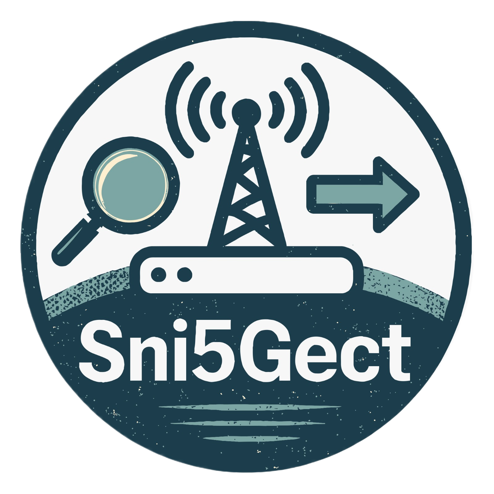

# Sni5Gect

> A framework for 5G NR Sniffing and Injection 

A 5G Sniffer and Injector on steroids... And yes, Wireshark supported!!!
Supports **DCI Sniffing**, **MAC-NR Downlink/Uplink message sniffing** and **MAC-NR Downlink/Uplink message injection**

[GitHub](https://github.com/asset-group/Sni5Gect-5GNR-sniffing-and-exploitation)
[Get Started](/get_started)
[Spectrogram](https://spectrogram.sni5gect.com/)
[Paper](https://www.usenix.org/conference/usenixsecurity25/presentation/luo-shijie)
[Artifacts](https://doi.org/10.5281/zenodo.16712370)
[Cite](/cite)
