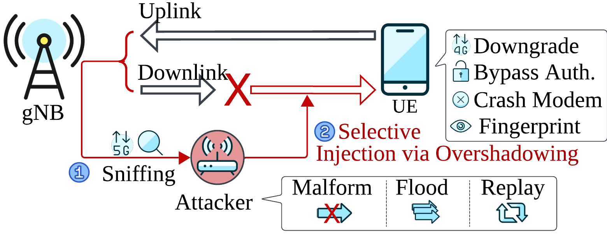
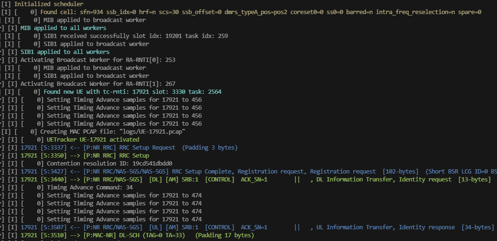
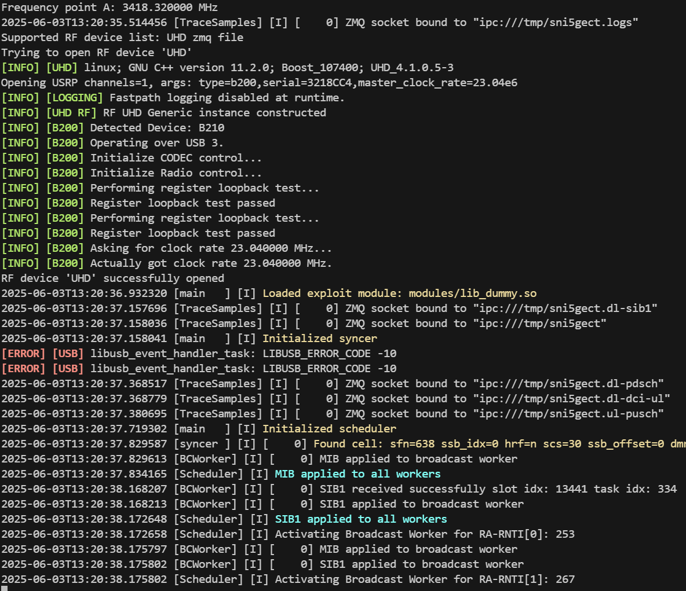
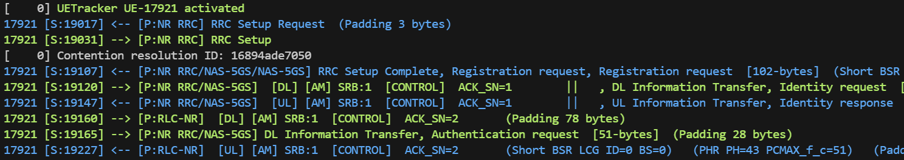
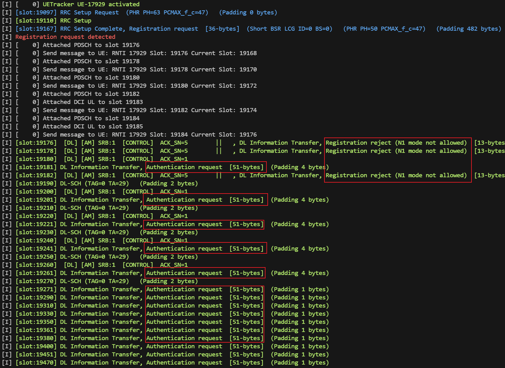
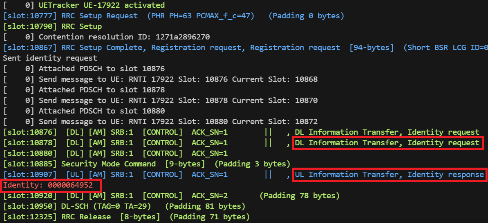
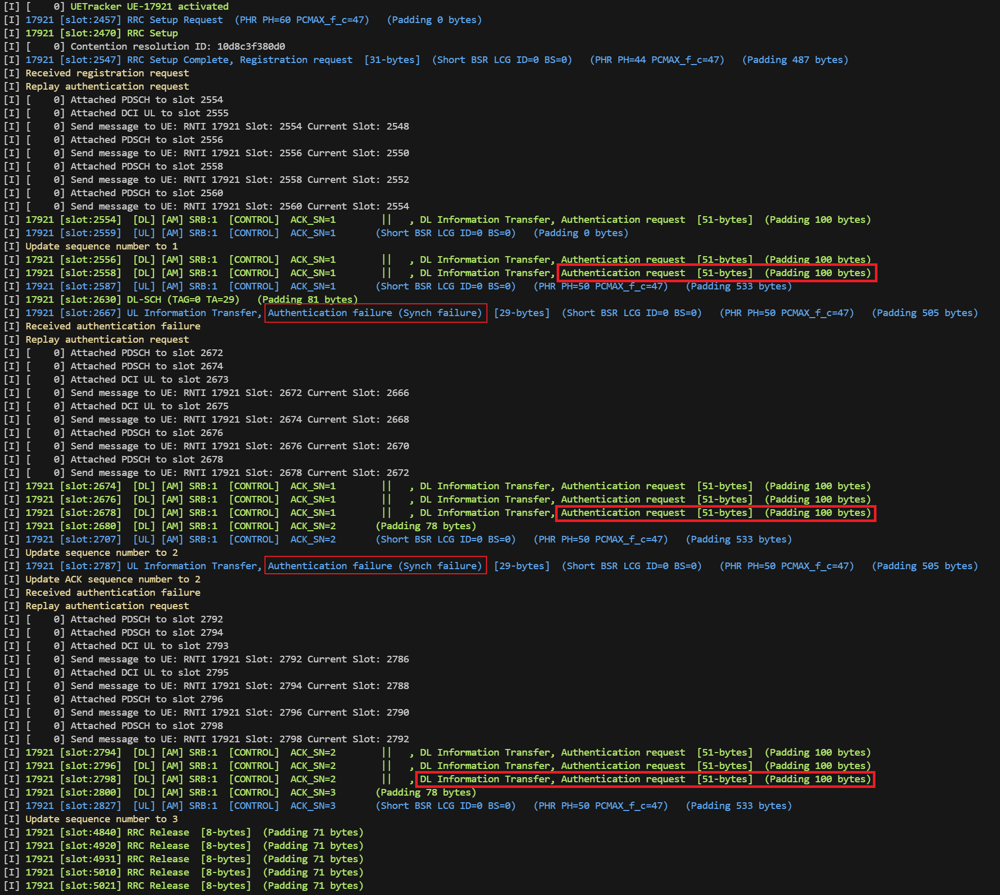
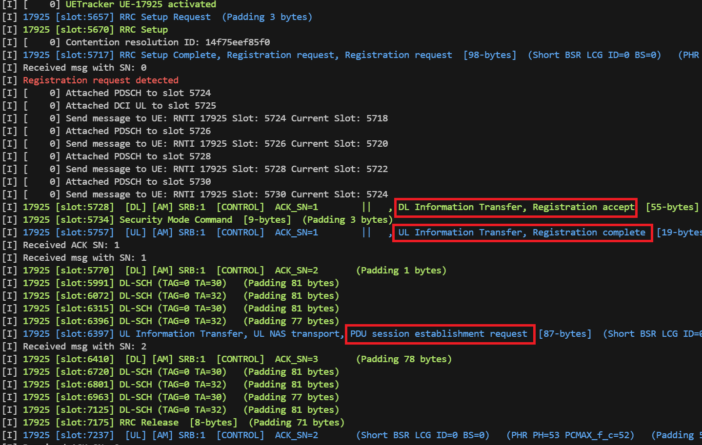
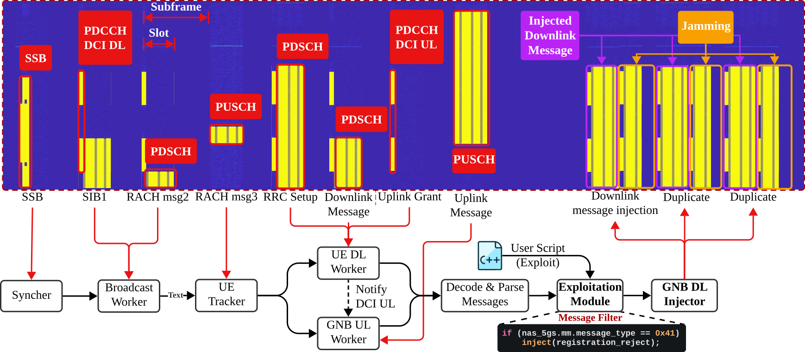

<a href="http://sni5gect.com/">
  
</a>

# 5G NR 嗅探与注入框架

<p align="left">
<a href="http://sni5gect.com/">
    
    
        
</a>
</p>

**Sni5Gect** 是一个用于嗅探未加密 5G 消息并向基站与用户设备（UE）之间的空口通信注入自定义数据包的框架。它可用于安全研究，执行诸如崩溃 UE 调制解调器、网络降级、设备指纹识别和认证绕过等攻击。该工具已在商用 UE（智能手机、调制解调器）以及 srsRAN/Effnet 基站上进行了测试。

#### 核心功能
* 嗅探：捕获基站与 UE 之间未加密的 5G MAC-NR 消息。
* 注入：在特定通信状态下向目标 UE/基站发送任意 MAC-NR 消息。
#### 示例用例
* 崩溃 UE 调制解调器。
* 降级攻击（5G 降至 4G）。
* 设备指纹识别。
* 异常检测。

*Sni5Gect 工件论文在第 34 届 USENIX Security Symposium 上获得了 **Available**、**Functional** 和 **Reproduced** 徽章。工件 PDF 可在[此处](https://raw.githubusercontent.com/asset-group/Sni5Gect-5GNR-sniffing-and-exploitation/main/docs/_media/USENIX_Security__25_Artifact_Appendix__SNI5GECT__A_Practical_Approach_to_Inject_aNRchy_into_5G_NR.pdf)获取。*

## 概览



## 通过 Docker 快速开始

我们建议在 Ubuntu 22.04 Docker 容器中运行整个技术栈，以确保依赖一致性并避免影响本地环境。

构建并启动 Docker 容器：

```bash
docker compose build sni5gect # 构建容器
docker compose up -d sni5gect # 启动容器
docker exec -it sni5gect bash # 进入容器
./build/shadower/shadower configs/srsran-n78-20MHz-b210.yaml # 运行嗅探器，频段 N78，带宽 20MHz
# 详见 README.md 中的"运行 Sni5Gect"部分
```

---

## 目录

- [支持的功能](#支持的功能)
- [更新日志](#更新日志)
- [系统要求](#系统要求)
- [运行 Sni5Gect](#运行-sni5gect)
- [攻击模块](#攻击模块)
  - [嗅探：DL/UL 与 DCI](#嗅探dlul-与-dci)
  - [崩溃：5Ghoul 攻击](#崩溃5ghoul-攻击)
  - [降级：注册拒绝](#降级注册拒绝)
  - [指纹识别：身份请求](#指纹识别身份请求)
  - [降级：认证重放](#降级认证重放)
  - [认证绕过：注册接受 5G AKA 绕过](#认证绕过注册接受-5g-aka-绕过)
- [示例配置](#示例配置)
- [组件概览](#组件概览)
- [项目结构](#项目结构)
- [免责声明](#免责声明)
- [引用 Sni5Gect](#引用-sni5gect)

## 支持的功能

我们已在以下配置上进行了测试：

- 频段：n78、n41（TDD）、n3（FDD）
- 频率：3427.5 MHz、2550.15 MHz、1865.0 MHz
- 子载波间隔：30 kHz、15 kHz
- 带宽：20–50 MHz
- MIMO 配置：单输入单输出（SISO）
- 距离：0 米至最远 20 米（使用放大器）

srsRAN 基站示例配置文件位于 `configs/base_station/srsran-n78-20MHz.yml`。


## 更新日志

### v4.0 - PUSCH 分配类型 B 嗅探与上行偏移自动调整 $\color{#f00}{\textsf{（2026年4月22日）}}$
本版本为 Sni5Gect 增加了若干新功能和改进：
- 自适应上行偏移估计
  Sni5Gect 使用 RAR 消息中的定时提前（TA）初始化上行偏移，并通过后续传输的 DMRS 时间偏移估计持续优化。

- 支持 OpenAirInterface gNB 嗅探（测试用例 #7）
  为实现兼容性：
  - 修改 `shadower/comp/sync/syncer.cc` 第 258 行，然后使用 `ninja -C build` 重新编译：
  ```
  samples_delayed = feedback.ssb_offset; // (uint32_t)round((double)feedback.delay_us * (srate * 1e-6));
  ```

- 专用 BWP 配置支持
  在 RRC Setup 和 RRC Reconfiguration 消息中增加了专用带宽部分（BWP）配置支持。

- 分段 RRC Reconfiguration 处理
  Sni5Gect 现在可以组装分段的 RRC Reconfiguration 消息。

- 改进的 ASN.1 解码（Release 17 兼容性）
  集成了 srsRAN 项目的 ASN.1 解码更新，修复了某些 Release 17 消息的解码问题。

- 支持启用变换预编码的 PUSCH 解码
  - 增加了启用变换预编码的 PUSCH 解码支持
  - 已在 srsRAN Band 5、10 MHz 上测试（测试用例 #6）。

*请注意，本版本引入了一些新的依赖项，请参考 Dockerfile 安装依赖，或使用 `docker compose build` 创建新容器（请在操作前备份现有工作）。*

### v3.0 - 上行注入支持 $\color{#f00}{\textsf{（2025年11月5日）}}$
本版本为 Sni5Gect 扩展了上行注入功能：
- 上行消息注入：利用基站发出的上行授权，构造并发送伪造的上行消息，使其看起来来自 UE。
- 支持的参数
  - 子载波间隔：15 kHz
  - 测试频段：FDD band n5
- 硬件要求：与 v1.0 相同。已使用 B210 SDR 测试验证。

**注意：**
  - 此功能通过使用观察到的授权来伪造 UE 发起的上行流量；请负责任地使用，且仅在经批准的测试环境中使用。
  - 由于硬件的严格时序要求，不支持 30 kHz 及以上的子载波间隔。

### v2.0 – FDD 支持 $\color{#f00}{\textsf{（2025年9月17日）}}$
本版本扩展了 Sni5Gect 的新功能：
- 双通道 FDD 支持：使用具有双 RX 链的 SDR 同时接收和处理两个通道的 IQ 采样。
- 统一代码库，支持 15 kHz 和 30 kHz 子载波间隔，无需重新编译。
- 扩展测试配置：
    - 频段：
        - TDD：n78、n41
        - FDD：n3
    - 频率：3427.5 MHz、2550.15 MHz、1865.0 MHz
    - 子载波间隔：30 kHz、15 kHz

**注意：**
由于 FDD 使用不同频率进行上下行传输，需要具有两个 RF 前端的 SDR（如 USRP X310）以同时捕获两个频率的 IQ 采样（否则 Sni5Gect 仅能嗅探下行通道）。强烈建议使用 GPSDO 进行频率同步；如果没有，可能需要手动校准。

### v1.0 – 初始版本 $\color{#f00}{\textsf{（2025年8月26日）}}$
Sni5Gect 的首个版本，支持 30 kHz 子载波间隔的 TDD 频段。
测试配置：
- 频段：n78、n41（TDD）
- 频率：3427.5 MHz、2550.15 MHz
- 子载波间隔：30 kHz
- 带宽：20–50 MHz
- MIMO 配置：单输入单输出（SISO）
- 距离：0 米至最远 20 米（使用放大器）


## 系统要求

### 硬件要求

Sni5Gect 使用 USRP 软件定义无线电（SDR）设备，在合法 5G 基站与 UE 之间的通信过程中发送和接收 IQ 采样。支持以下 SDR：

- USRP B210 SDR
- USRP X310 SDR

主机推荐配置：

- 最低：12 核 CPU
- 16 GB 内存

我们的配置使用 AMD 5950x 处理器和 32 GB 内存。

### 软件要求

- 操作系统：Ubuntu 22.04（容器化环境）
- 注意：主机应专用于 Sni5Gect，不运行资源密集型应用程序（如 GUI），以防止 SDR 溢出。

#### Sni5Gect 使用以下软件组件

- [wDissector](https://github.com/asset-group/5ghoul-5g-nr-attacks)：用于分析空口流量。
- [Wireshark 显示过滤器](https://www.wireshark.org/docs/dfref/)：用于识别通信状态。

Sni5Gect 构建于 [srsRAN 4G](https://github.com/srsran/srsRAN_4G) 之上，利用了 SSB 搜索、PBCH 解码、PDCCH 解码、PDSCH 编解码和 PUSCH 解码等功能。

### 已评估设备

以下 COTS（商用现货）设备已进行评估：

|型号|调制解调器|补丁版本|
|-----|-----|-------------|
|OnePlus Nord CE 2 IV2201|MediaTek MT6877V/ZA|2023-05-05|
|Samsung Galaxy S22 SM-S901E/DS|Snapdragon X65|2024-06-01|
|Google Pixel 7 |Exynos 5300|2023-05-05|
|Huawei P40 Pro ELS-NX9|Balong 5000|2024-02-01|
|Fibocom FM150-AE USB modem|Snapdragon X55|NA|

## 运行 Sni5Gect

Sni5Gect 可执行文件位于 `build/shadower` 目录中，配置文件位于 `configs` 文件夹中。

### 使用示例连接录制运行

使用 Sni5Gect 最简单的方式是运行预录制的 IQ 采样文件。我们提供了一个用于离线测试的样本。

1. 从 Zenodo 下载并解压示例录制文件：

```bash
wget https://zenodo.org/records/15601773/files/example-connection-samsung-srsran.zip
unzip example-connection-samsung-srsran.zip
```

2. 编辑 `configs/config-srsran-n78-20MHz.conf`，将 `source` 部分修改如下：

```yaml
source:
  source_type: file
  source_params: /root/sni5gect/example_connection/example.fc32

rf:
  sample_rate: 23.04e6
  num_channels: 1
  uplink_cfo: 0 # 上行载波频率偏移校正（Hz）
  downlink_cfo: 0 # 下行载波频率偏移（CFO）（Hz）
```

3. 最后使用以下命令启动嗅探器：

```bash
./build/shadower/shadower configs/srsran-n78-20MHz-b210.yaml
```

你应该会看到类似以下截图的输出：


### 使用 SDR 运行（实时嗅探）

要使用软件定义无线电（SDR）测试 Sni5Gect 的实时空口信号，请将配置文件中的信号源更新为 SDR。

UHD 兼容 SDR（如 USRP B200）的 `source` 和 `rf` 配置示例：

```yaml
source:
  source_type: uhd
  source_params: type=b200,master_clock_rate=23.04e6

rf:
  sample_rate: 23.04e6
  num_channels: 1
  uplink_cfo: -0.00054 # 上行载波频率偏移校正（Hz）
  downlink_cfo: 0 # 下行载波频率偏移（CFO）（Hz）
  padding:
    front_padding: 0 # 每个突发前端填充的 IQ 采样数
    back_padding: 0 # 每个突发尾部填充的 IQ 采样数
  channels:
    - rx_frequency: 3427.5e6
      tx_frequency: 3427.5e6
      rx_offset: 0
      tx_offset: 0
      rx_gain: 40
      tx_gain: 80
      enable: true
```

然后使用以下命令启动嗅探器：

```bash
./build/shadower/shadower configs/srsran-n78-20MHz-b210.yaml
```

启动后，Sni5Gect 将执行以下操作：

1. 使用指定的中心频率和 SSB 频率搜索基站。
2. 从 SIB1 获取小区配置。
3. 检测 RAR 消息，标识有新 UE 正在连接到目标基站。


## 攻击模块

攻击模块旨在提供一种灵活的方式来加载不同的攻击或漏洞利用。当接收到消息时，首先将其发送到 wDissector 进行数据包分析，如果数据包匹配指定的任何 [Wireshark 显示过滤器](https://www.wireshark.org/docs/dfref/)，则根据指定的 `post_dissection` 做出响应，可以是向通信中注入消息，也可以是提取特定字段。

### 嗅探：DL/UL 与 DCI

此模块执行被动嗅探。wDissector 框架解析数据包并提供接收到的数据包摘要。

```conf
exploit: modules/lib_dummy.so 
```

示例输出：


#### DCI 嗅探

要实时监控解码的 DCI（下行控制信息）消息，请设置以下日志配置：

```conf
worker_log_level = DEBUG
```

设置此选项后，嗅探器将记录详细的 DCI 相关信息，包括：

- DCI UL（上行调度）
- PUSCH 解码结果
- DCI DL（下行调度）
- PDSCH 解码结果

示例输出：

```bash
[D] [    0] DCI UL slot 6732 17503: c-rnti=0x4601 dci=0_0 ss=common0 L=2 cce=0 f_alloc=0x498 t_alloc=0x0 hop=n mcs=9 ndi=1 rv=0 harq_id=0 tpc=1 
[D] [    0] PUSCH 6734 17507: c-rnti=0x4601 prb=(3,26) symb=(0,13) CW0: mod=QPSK tbs=528 R=0.670 rv=0 CRC=OK iter=1.0 evm=0.04 t_us=249 epre=+16.6 snr=+24.0 cfo=-2657.6 delay=-0.0 
[I] 17921 [S:17507] <-- [P:NR RRC/NAS-5GS/NAS-5GS] RRC Setup Complete, Registration request, Registration request  [113-bytes] (Padding 405 bytes) 
[D] [    0] DCI DL slot 6741 17520: c-rnti=0x4601 dci=1_1 ss=ue L=1 cce=4 f_alloc=0x14 t_alloc=0x0 mcs=20 ndi=0 rv=0 harq_id=0 dai=0 tpc=1 harq_feedback=3 ports=0 srs_request=0 dmrs_id=0 
[D] [    0] PDSCH 6741 17520: c-rnti=0x4601 prb=(20,20) symb=(2,13) CW0: mod=64QAM tbs=54 R=0.593 rv=0 CRC=OK iter=1.0 evm=0.00 epre=+11.2 snr=+39.5 cfo=-0.7 delay=-0.0 
[I] 17921 [S:17520] --> [P:NR RRC/NAS-5GS] DL Information Transfer, Identity request  [13-bytes]  (Padding 31 bytes) 
```

### 崩溃：5Ghoul 攻击

这些漏洞利用来自论文 [5Ghoul: Unleashing Chaos on 5G Edge Devices](https://asset-group.github.io/disclosures/5ghoul/)。它们影响 OnePlus Nord CE2 的 MTK 调制解调器。

|CVE|模块|
|---|------|
|CVE-2023-20702|lib_mac_sch_rrc_setup_crash_var.so|
|CVE-2023-32843|lib_mac_sch_mtk_rrc_setup_crash_3.so|
|CVE-2023-32842|lib_mac_sch_mtk_rrc_setup_crash_4.so|
|CVE-2024-20003|lib_mac_sch_mtk_rrc_setup_crash_6.so|
|CVE-2023-32845|lib_mac_sch_mtk_rrc_setup_crash_7.so|

在接收到 UE 的 `RRC Setup Request` 消息后，Sni5Gect 向目标 UE 回复畸形的 `RRC Setup`。如果 UE 接受了这条畸形的 `RRC Setup` 消息，它会立即崩溃，这可以通过 adb 日志中包含关键字 `sModemReason` 来确认，该关键字表明 MTK 调制解调器崩溃。例如：

```
MDMKernelUeventObserver: sModemEvent: modem_failure
MDMKernelUeventObserver: sModemReason:fid:1567346682;cause:[ASSERT] file:mcu/l1/nl1/internal/md97/src/rfd/nr_rfd_configdatabase.c line:4380 p1:0x00000001
```

### 降级：注册拒绝

利用论文 [Never Let Me Down Again: Bidding-Down Attacks and Mitigations in 5G and 4G](https://dl.acm.org/doi/10.1145/3558482.3581774) 中的 TC11 攻击。在接收到 UE 的 `Registration Request` 后注入 `Registration Reject` 消息，导致 UE 断开 5G 连接并降级到 4G。由于基站可能不知道 UE 已断开连接，它可能继续发送 `Security Mode Command`、`Identity Request`、`Authentication Request` 等消息。

```conf
exploit: modules/lib_dg_registration_reject.so 
```

示例输出：


### 指纹识别：身份请求

通过在接收到 `Registration Request` 后注入 `Identity Request` 消息来演示指纹识别攻击。如果 UE 接受，它会回复包含 SUCI 信息的 `Identity Response`。

```conf
exploit: modules/lib_identity_request.so 
```

示例输出：


### 降级：认证重放

此漏洞利用对应 `CVD-2024-0096`。这是我们最复杂的攻击，涉及两个阶段：嗅探和重放。在重放阶段，需要在多个不同状态下同时进行嗅探和注入。

1. 嗅探：捕获基站发送给 UE 的合法 Authentication Request。

```conf
exploit: modules/lib_dg_authentication_request_sniffer.so 
```

2. 重放：使用捕获的 MAC-NR 值更新 `shadower/modules/dg_authentication_replay.cc`。重新编译模块：

```bash
ninja -C build
```

然后加载模块：

```conf
exploit: modules/lib_dg_authentication_replay.so
```

在接收到 UE 的 `Registration Request` 后，Sni5Gect 向目标 UE 重放捕获的 `Authentication Request` 消息。UE 在接收到重放的 `Authentication Request` 消息后，会回复包含原因 `Synch Failure` 的 `Authentication Failure` 消息并启动定时器 T3520。然后 Sni5Gect 相应地更新其 RLC 和 PDCP 序列号，并继续重放 `Authentication Request` 消息数次。最终，在多次尝试且定时器 T3520 过期后，UE 认为网络未通过认证检查，本地释放通信，并将当前小区视为禁止小区。如果没有其他 5G 基站可用，UE 将降级到 4G，并根据规范 3GPP TS 24.501 version 16.5.1 Release 16 `5.4.1.2.4.5 UE 中的异常情况` 保持降级状态最长 300 秒。（某些手机可能保持降级状态更长时间。）

在示例输出中，我们可以从以下截图中看到 UE 回复了两次 `Authentication Failure` 消息。


### 认证绕过：注册接受 5G AKA 绕过

此漏洞利用来自论文 [Logic Gone Astray: A Security Analysis Framework for the Control Plane Protocols of 5G Basebands](https://www.usenix.org/conference/usenixsecurity24/presentation/tu) 中的 $I_8$ 5G AKA 绕过。仅搭载 Exynos 调制解调器的 Pixel 7 手机受影响。
在接收到 UE 的 `Registration Request` 后，Sni5Gect 注入安全头为 4 的明文 `Registration Accept` 消息。UE 会忽略错误的 MAC，接受 `Registration Accept` 消息，并回复 `Registration Complete` 和 `PDU Session Establishment Requests`。由于核心网接收到这些意外消息，它会指示 gNB 通过发送 `RRC Release` 消息立即终止连接来释放连接。

```conf
exploit: modules/lib_plaintext_registration_accept.so
```

示例输出：


## 示例配置

`configs/srsran-n78-20MHz-b210.yaml` 中提供了示例配置：

```conf
cell:
  band: 78 # 频段号
  nof_prb: 51 # 物理资源块数量
  scs_common: 30 # 公共子载波间隔（kHz）
  scs_ssb: 30 # SSB 子载波间隔（kHz）
  ssb_period_ms: 10 # SSB 周期（毫秒）
  dl_arfcn: 628500 # 下行 ARFCN
  ssb_arfcn: 628128 # SSB ARFCN


source:
  source_type: uhd
  source_params: type=b200,master_clock_rate=23.04e6

enable_recorder: false # 将 IQ 采样录制到文件
pcap_folder: logs/

rf:
  sample_rate: 23.04e6
  num_channels: 1
  uplink_cfo: -0.00054 # 上行载波频率偏移校正（Hz）
  downlink_cfo: 0 # 下行载波频率偏移（CFO）（Hz）
  padding:
    front_padding: 0 # 每个突发前端填充的 IQ 采样数
    back_padding: 0 # 每个突发尾部填充的 IQ 采样数
  channels:
    - rx_frequency: 3427.5e6  # 每个通道的实际接收频率
      tx_frequency: 3427.5e6  # 每个通道的实际发送频率
      rx_offset: 0            # 接收频率手动校准
      tx_offset: 0            # 发送频率手动校准
      rx_gain: 40             # 每个通道使用的接收增益
      tx_gain: 80             # 每个通道使用的发送增益
      enable: true            # 是否启用此通道

workers:
  pool_size: 24 # 工作线程池大小
  n_ue_dl_worker: 4 # UE 下行工作线程数
  n_ue_ul_worker: 4 # UE 上行工作线程数
  n_gnb_dl_worker: 4 # gNB 下行工作线程数
  n_gnb_ul_worker: 4 # gNB 上行工作线程数

uetracker:
  close_timeout: 5000 # 毫秒：如果没有收到消息则停止跟踪
  parse_messages: true # 解析消息
  num_ues: 5 # 预初始化的 UETracker 数量
  enable_gpu: false # 解码 GPU 加速

downlink_injector:
  delay_n_slots: 5 # 注入消息的延迟时隙数
  duplications: 2 # 每次注入发送的重复次数
  tx_cfo_correction: 0 # 上行 CFO 校正（Hz）
  tx_advancement: 160 # 提前发送的采样数
  pdsch_mcs: 3 # PDSCH MCS
  pdsch_prbs: 24 # PDSCH PRB 数

log:
  log_level: INFO
  syncer: INFO
  worker: INFO
  bc_worker: INFO

exploit: build/modules/lib_dummy_exploit.so # 使用的攻击模块
# exploit:  build/modules/lib_identity_request.so
# exploit:  build/modules/lib_dg_authentication_request_sniffer.so
# exploit:  build/modules/lib_dg_authentication_replay.so
# exploit:  build/modules/lib_dg_registration_reject.so
# exploit:  build/modules/lib_mac_sch_mtk_rlc_crash.so
# exploit:  build/modules/lib_mac_sch_mtk_rrc_setup_crash_3.so
# exploit:  build/modules/lib_mac_sch_mtk_rrc_setup_crash_4.so
# exploit:  build/modules/lib_mac_sch_mtk_rrc_setup_crash_6.so
# exploit:  build/modules/lib_mac_sch_mtk_rrc_setup_crash_7.so
# exploit:  build/modules/lib_plaintext_registration_accept.so
```

## 组件概览

Sni5Gect 由多个组件组成，每个组件负责处理不同的信号：

- Syncer（同步器）：与目标基站进行时间和频率同步。
- Broadcast Worker（广播工作器）：解码 SIB1 等广播信息，检测和解码 RAR。
- UETracker（UE 跟踪器）：跟踪 UE 与基站之间的连接。
- UE DL Worker（UE 下行工作器）：解码基站发送给 UE 的消息。
- GNB UL Worker（gNB 上行工作器）：解码 UE 发送给基站的消息。
- GNB DL Injector（gNB 下行注入器）：编码并向 UE 发送消息。



## 项目结构

项目组织如下。Sni5Gect 核心框架位于 `shadower` 目录中。关键组件在以下文件中实现：

```
.
├── cmake
├── configs
├── credentials
├── debian
├── images
├── lib
|-- shadower
|   |-- CMakeLists.txt
|   |-- comp
|   |   |-- CMakeLists.txt
|   |   |-- fft
|   |   |-- scheduler.cc  # 将接收到的子帧分发给各组件
|   |   |-- ssb
|   |   |-- sync          # Syncer 实现
|   |   |-- trace_samples
|   |   |-- ue_tracker.cc # UE Tracker 实现
|   |   |-- ue_tracker.h
|   |   `-- workers
|   |       |-- CMakeLists.txt
|   |       |-- broadcast_worker.cc # 广播工作器实现
|   |       |-- gnb_dl_worker.cc    # gNB 下行注入器实现
|   |       |-- gnb_ul_worker.cc    # gNB 上行工作器实现
|   |       |-- ue_dl_worker.cc     # UE 下行工作器实现
|   |       |-- wd_worker.cc        # wDissector 封装
|   |-- main.cc
|   |-- modules   # 攻击模块
|   |-- source
|   |-- test
|   |-- tools
|   `-- utils
├── srsenb
├── srsepc
├── srsgnb
├── srsue
├── test
└── utils
```

## 免责声明

本框架仅用于研究和教育目的。未经授权在公共实时网络或设备上使用 Sni5Gect 可能违反当地法律法规。
作者和贡献者不对任何滥用行为承担责任。

## 引用 Sni5Gect

```
@inproceedings{
  author={Shijie Luo and Garbelini Matheus E and Chattopadhyay Sudipta and Jianying Zhou},
  booktitle={34th USENIX Security Symposium (USENIX Security 25)},
  title={Sni5Gect: A Practical Approach to Inject aNRchy into 5G NR}, 
  year={2025},
}
```
